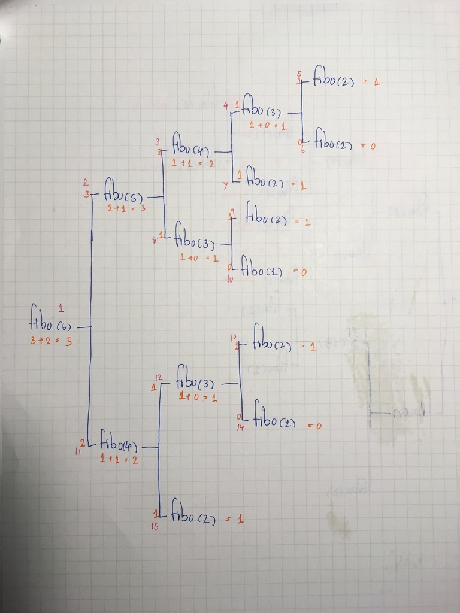

# Function
นอกจากโครงสร้างของ function แล้ว เรื่องของ function ก็จะมีอยู่สามเรื่องคือ 
* no return function
* return function
* recursive function 

## โครงสร้างของ function
### parameter, argument, return
* parameter และ argument
    * paremeter เป็นตัวบอกว่าเราต้องการรับอะไรมาใช้ใน function บ้าง
    * argument คือสิ่งที่เราส่งเข้าไปเพื่อใช้มันใน function 
* return และ no return
    * หากเรา return ค่าออกมาจาก function เราสามารถกำหนดค่าให้ตัวแปรด้วยการเรียกใช้ function นั้นได้
       * และ function นั้นจะถือว่าเป็นนิพจน์ที่มีค่า เป็นค่าเดียวกับที่ function นั้น return ออกมา
    * หากเราไม่ return ค่าออกมาจาก function เราจะไม่สามารถกำหนดค่าให้ตัวแปรด้วยการเรียกใช้ function นั้นได้
```javascript
function no_return_name(parameter) {
  print(parameter)
}
no_return_name('hello world')

//'hello world' เป็น arguemnt ของ function no_return_name

function return_name(parameter) {
  return parameter 
}
return_name('hello world')

//'hello world' เป็น arguemnt ของ function return_name
```
จะเห็นว่ามัน print ออกมาแค่ครั้งเดียว ทั้งที่เราเรียกใช้ทั้ง function no_return_name และ return_name
ต่อไปจะเป็นความต่างของ no return และ return function 
```javascript
//วางโค้ดต่อจากข้างบน
let a = no_return_name('hello world')
let b = return_name('hello world')
print('a: ' + a)
print('type a:' + typeof(a))
print('b: ' + b)
print('type b:' + typeof(b))

//หรือเราจะทำแบบนี้ก็ได้ 
print(return_name('แบบนี้ก็ได้'))
```
เห็นความแตกต่างหรือยัง 🙂

### function scope
ไม่แน่ใจว่าเรื่องนี้จะเกินที่กำลังเรียนอยู่หรือเปล่า ถ้าเกินก็ข้ามไปก่อนก็ได้ 
โครงสร้างอีกอย่างหนึ่งของ function คือ function scope, local ง่ายๆก็คือ เราไม่สามารถเข้าถึงตัวแปรที่เราประกาศ/กำหนดไว้ใน function จากข้างนอก function ได้ เช่น
```javascript
you = 'you'

//name is parameter of function hello
function hello(name) {
let word = 'hello '
print(word + name)
}

//you is argument
hello(you)
print(word) // error เข้าถึงตัวแปร word จากข้างนอกฟังก์ชันไม่ได้
```

ทีนี้ก็ Recursive Function
## Recursive Function 
function ที่เรียกตัวเอง ใน block ของฟังก์ชัน เช่น
```javascript
//ตามหา fibonacchi ตัวที่ n
//ลำดับ fibonacchi = 0, 1, 1, 2, 3, 5 ...
function fibo(n) {
   if (n == 1) return 0 //ตัวที่ 1 คือ 0
   else if (n == 2) return 1 //ตัวที่ 2 คือ 1
   else {
      return fibo(n-1) + fibo(n-2) //ตัวที่ n คือ ตัวก่อนหน้ามันตัวที่ 1 + ตัวก่อนหน้ามันตัวที่ 2 
   }
}
print(fibo(6))

```
โดยลำดับ function call และค่าของมันก็จะเป็นแบบนี้ <br >
สีแดง = ลำดับของ function call <br >
สีส้ม = ค่าที่การ return จาก function นั้น


ที่ทำ `fibo(n-1)` ก่อน `fibo(n-2)` ก็เพราะ `+` ทำจากซ้ายไปขวา 

ก็จะขอจบเรื่องของ function ไว้เพียงเท่านี้ 
