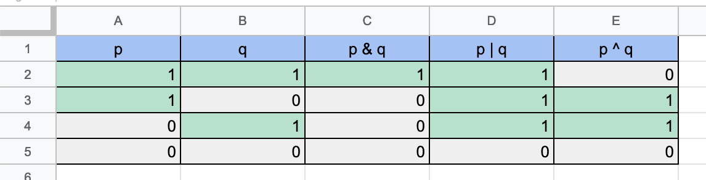

# Base numbers 
## เรื่องทั่วไป 
เลขฐาน 2, ฐาน 10, ฐาน 16
ที่มีชื่อแบบนั้น ก็เพราะว่า 
เลขฐาน 2  : 0, 1
เลขฐาน 10 : 0, 1, 2, 3, 4, 5, 6, 7, 8, 9
เลชฐาน 16 : 0, 1, 2, 3, 4, 5, 6, 7, 8, 9, A, B, C, D, E, F 
นั่นแหละ 

## binary operation 
### and (&)
เจอ 0 -> 0
### or  (|)
เจอ 1 -> 1
### xor (^)
เหมือนกัน -> 0, ต่างกัน -> 1
### ตาราง
&, |, ^ truth table
&, |, ^ 
### sum (+) 
